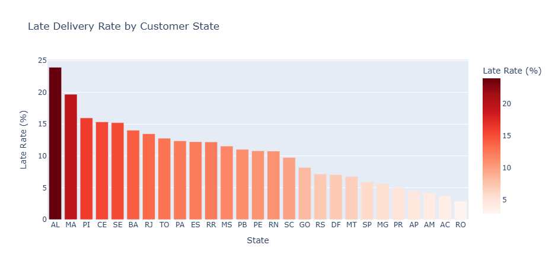
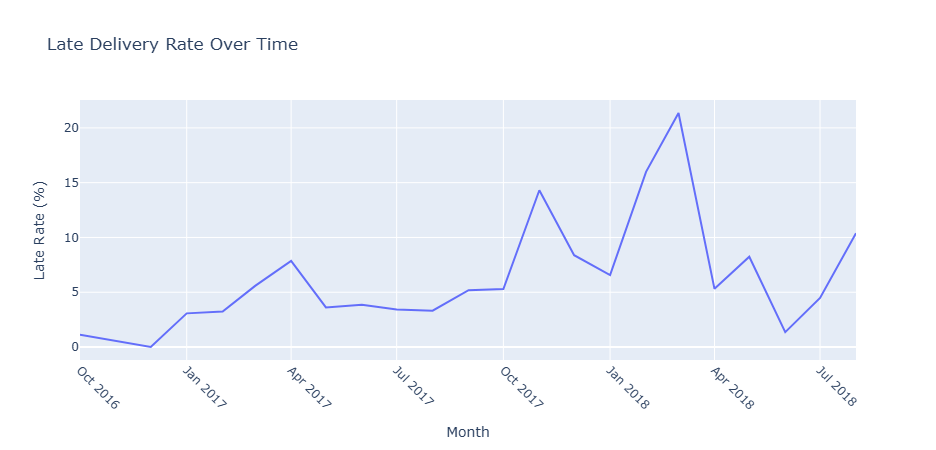
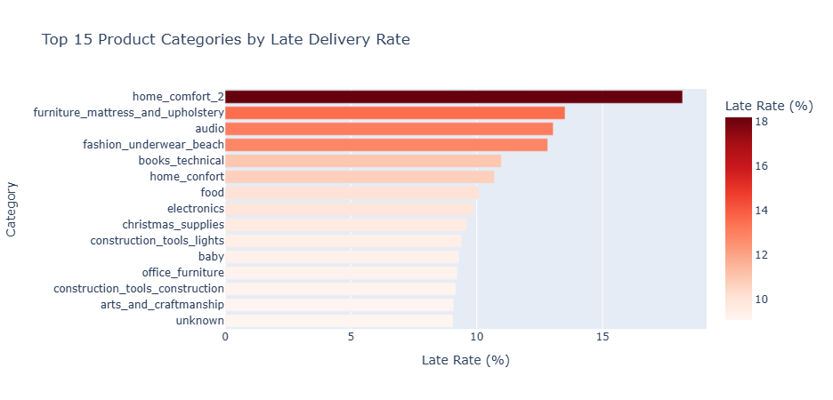
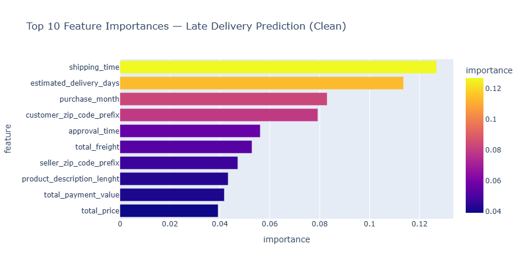

<p align="center">
  
</p>

<p align="center">
  
</p>

<p align="center">
  
  
  
  
  
  
  <a href="https://www.kaggle.com/datasets/olistbr/brazilian-ecommerce">
    
  </a>
</p>

---

## Overview

This project analyzes the [Olist Brazilian E-Commerce dataset](https://www.kaggle.com/datasets/olistbr/brazilian-ecommerce) — a real-world relational database of **9 tables** covering orders, customers, products, sellers, payments, and reviews from 2016–2018.

The core challenge of this project is not just the machine learning — it is the **data engineering layer**: joining 9 relational tables correctly into a single order-level dataset before any analysis can begin. Decisions like aggregating before joining, deduplicating reviews, and defining the right unit of analysis are what make this project meaningful.

**Business Question**
> Among orders that were delivered, what factors predict whether an order will arrive after its estimated delivery date?

**ML Target:** `is_late` — 1 if `order_delivered_customer_date > order_estimated_delivery_date`, else 0

---

## Key Numbers

| | |
|---|---|
| Total Delivered Orders | 96,454 |
| Late Delivery Rate | 8.11% |
| Model | Random Forest Classifier |
| F1-Score (Late Class) | 0.33 |
| Top Predictor | Shipping time from seller to carrier |

---

## Where Deliveries Fail

### By Region



Northeast Brazil dominates the late delivery ranking — Alagoas (24%), Maranhao (20%), Piaui (16%). These states sit far from Sao Paulo, where the majority of Olist sellers are based. The further the customer is from the seller hub, the harder it is to meet the estimated delivery window. This is a structural logistics problem, not a seller behavior problem.

### Over Time



The late delivery rate was relatively stable through 2017 before spiking sharply to **21.4% in March 2018** — nearly triple the average. This coincides with Brazil's Carnival season (February/March), when logistics networks are strained by reduced workforce and surge in consumer demand. The spike confirms that seasonal capacity planning is a critical gap in Olist's delivery operations.

### By Product Category



Home comfort, furniture, and audio equipment have the highest late rates. These are bulky, heavy items that require special handling and longer transit times. The pattern confirms that product weight and dimensions are meaningful predictors of delivery delays.

---

## Impact on Customer Satisfaction

Late delivery is not just an operational problem — it directly damages how customers feel about their experience. Orders that arrived late received an average review score of **2.62 out of 5**, compared to **4.30** for on-time orders. That is a drop of nearly 40% in satisfaction. For a marketplace like Olist, where seller reputation drives repeat purchases, late delivery is a revenue risk, not just a logistics inconvenience.

---

## Machine Learning

**Model:** Random Forest Classifier with `class_weight='balanced'` to handle the 8.1% minority class (late orders).

**Evaluation:** Precision, Recall, F1-Score — not accuracy, which would be misleading on an imbalanced dataset.

| Class | Precision | Recall | F1-Score |
|---|---|---|---|
| On Time (0) | 0.93 | 0.98 | 0.96 |
| Late (1) | 0.56 | 0.23 | 0.33 |

**Data Leakage Caught**

During feature selection, `review_score` appeared as the most important feature by a large margin. However, customers only leave reviews after delivery — meaning this column is a consequence of lateness, not a cause. Using it would allow the model to "cheat" by reading the outcome. Removing it dropped the late-class F1 from 0.52 to 0.33 — a lower score, but an honest one.

### Feature Importance (Clean Model)



All top 3 features are time-based: **shipping time** (how fast the seller hands off to the carrier), **estimated delivery days** (how optimistic the delivery window was set), and **purchase month** (seasonal effects). This tells a clear business story — late delivery is primarily a logistics speed problem. Olist should focus on reducing seller processing time and improving delivery estimate accuracy, especially during peak seasons.

---

## Analysis Pipeline

```
Load 9 relational CSVs
        |
Filter to delivered orders only — create is_late target
        |
Aggregate order_items and order_payments to order level
        |
Deduplicate order_reviews — keep most recent per order
        |
Join all 9 tables — maintain 96,478 rows throughout
        |
Clean nulls — fill or drop, zero nulls remaining
        |
Feature engineering — extract time-based features from timestamps
        |
Train Random Forest — remove data leakage — evaluate with F1
        |
Export to Power BI — build 2-page interactive dashboard
```

---

## Join Design Decisions

| Decision | Reason |
|---|---|
| Aggregate `order_items` before joining | One order can have multiple items — naive join inflates row count |
| Aggregate `order_payments` before joining | One order can have split payments across methods |
| Deduplicate `order_reviews` by most recent | Some orders had multiple reviews — keep latest |
| Filter to `delivered` status only | Cancelled orders are a separate prediction problem |
| Remove `review_score` from features | Data leakage — only available after delivery occurs |

---

## Project Structure

```
olist-ecommerce-analysis/
|
|-- data/
|   |-- raw/                    9 original CSV files from Kaggle
|   |-- processed/
|       |-- olist_final.csv     Merged and cleaned (96,454 rows x 36 cols)
|
|-- notebooks/
|   |-- olist_ecommerce_analysis.ipynb
|
|-- dashboard/
|   |-- Olist_E-Commerce_project.pbix
|
|-- images/
|   |-- eda/
|   |-- ml/
|   |-- dashboard/
|
|-- README.md
```

---

[Dataset — Olist Brazilian E-Commerce on Kaggle](https://www.kaggle.com/datasets/olistbr/brazilian-ecommerce)

<p align="center">
  
</p>
