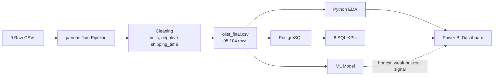
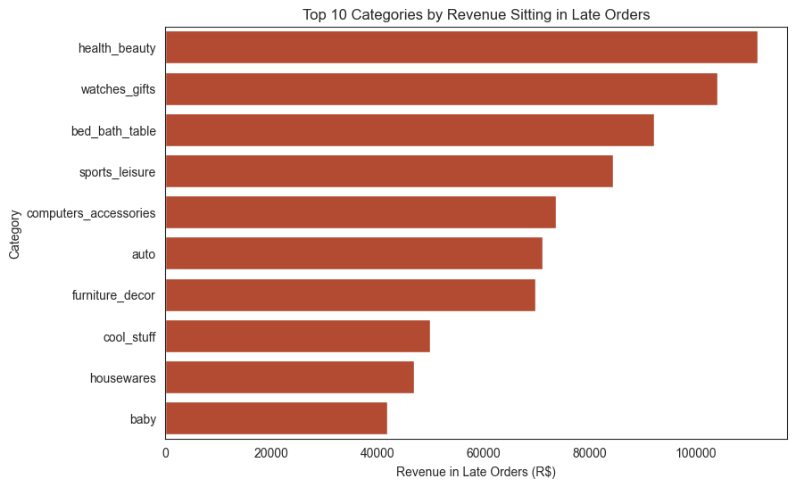
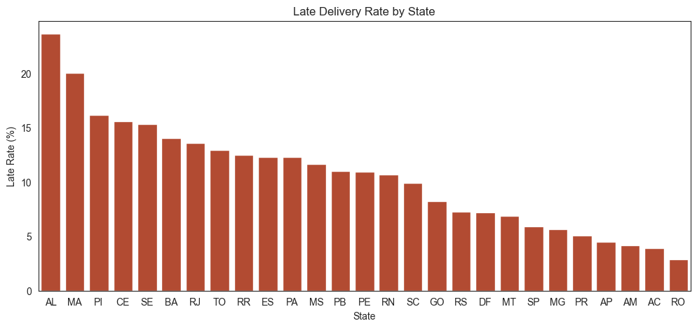
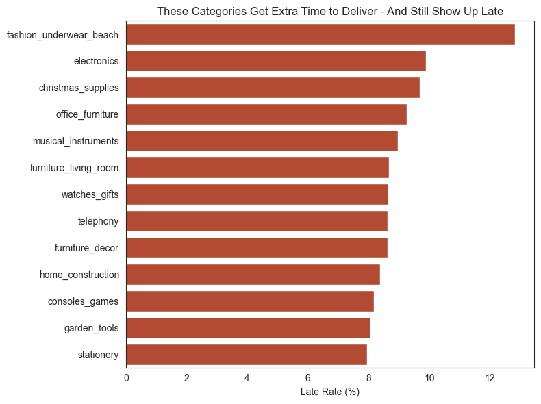
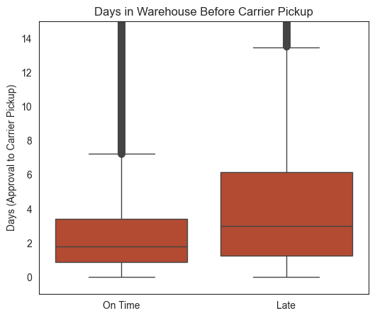
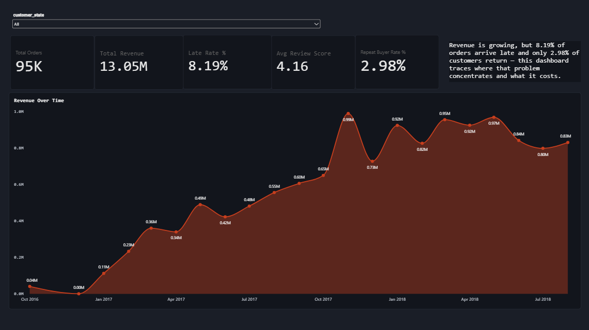
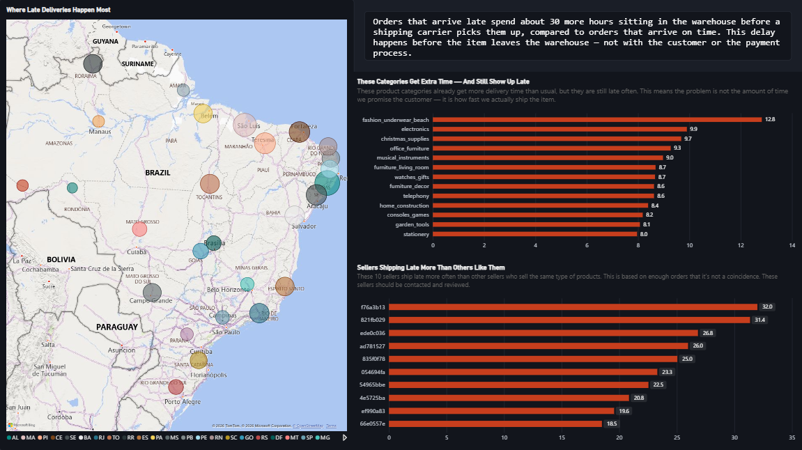
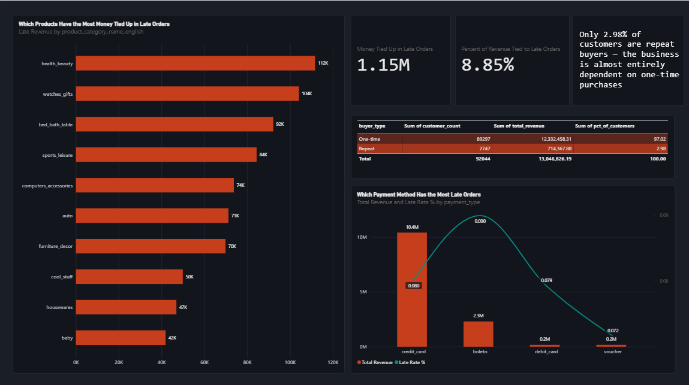

<div align="center">


<br/>


</div>

<br/>

## The Question

> **Revenue is growing — but 8.19% of orders arrive late and only 2.98% of customers ever come back. Where does that problem actually live, what does it cost, and can we predict who it hurts next?**

This project is an end-to-end analysis of the [Olist Brazilian E-Commerce](https://www.kaggle.com/datasets/olistbr/brazilian-ecommerce) dataset — 9 raw tables joined, cleaned, and pushed through a full **SQL → Python EDA → Power BI → Machine Learning** pipeline to answer that one question with real numbers, not guesses.

<br/>

## Table of Contents

- [The Question](#the-question)
- [Tech Stack](#tech-stack)
- [Pipeline Overview](#pipeline-overview)
- [Data Cleaning](#data-cleaning--what-got-fixed)
- [EDA — Four Business Questions](#eda--four-business-questions)
- [SQL KPIs](#sql-business-kpis)
- [Power BI Dashboard](#power-bi-dashboard)
- [Machine Learning](#machine-learning-predicting-bad-review-risk)
- [Key Takeaways](#key-business-takeaways)
- [Repo Structure](#repo-structure)
- [How to Reproduce](#how-to-reproduce)

<br/>

## Tech Stack

<div align="center">

| Layer | Tools |
|:--|:--|
| **Data Cleaning & EDA** | Python, pandas, seaborn, matplotlib |
| **Database** | PostgreSQL 18 + pgAdmin 4, SQLAlchemy |
| **Machine Learning** | scikit-learn (RandomForestClassifier) |
| **Dashboard** | Power BI Desktop (3-page, dark theme) |
| **Geolocation** | Olist geolocation dataset, joined by ZIP prefix |

</div>

<br/>

## Pipeline Overview



**Raw inputs:** customers, orders, order items, payments, reviews, products, sellers, category translation, **geolocation** (9 tables total — geolocation was added specifically to enable map visuals and future distance-based features).

<br/>

## Data Cleaning — What Got Fixed

Real data is never clean on the first pass. Here's what was actually caught and corrected, not just assumed:

- **1,350 orders (1.40%)** had a logically impossible **negative `shipping_time`** (carrier pickup logged *before* approval) — removed.
- Missing product dimensions filled with category median; missing `review_score` marked distinctly (not imputed as a guess).
- Missing geolocation coordinates for ~480 orders backfilled with **state-level average** coordinates rather than dropped.
- Zero duplicate rows, zero remaining nulls, confirmed via automated validation checks — not just eyeballed.

<br/>

## EDA — Four Business Questions

Every chart here answers a real decision, not just "here's a distribution." Common-sense findings (e.g. *"late delivery lowers review scores"*) were deliberately cut in favor of questions with a genuine **"I didn't expect that"** answer.

<details open>
<summary><b>1. Where does late delivery actually cost the most money?</b></summary>
<br/>



**R$1,154,385 (8.85%) of total revenue** sits in orders that arrived late. `health_beauty` alone accounts for R$111,661 of that — the number to weigh against the cost of fixing fulfillment in that category, not just a late-rate percentage.
</details>

<details>
<summary><b>2. Which states have the worst delivery reliability?</b></summary>
<br/>



Worst states (AL 23.7%, MA 20.0%, PI 16.2%) are all **small revenue contributors** — the delivery problem is concentrated in the smallest markets, not the biggest one (SP, 38% of revenue, sits near the bottom at 5.95%). That changes the cost/benefit of fixing it entirely.
</details>

<details>
<summary><b>3. Are we giving enough delivery time, or is fulfillment itself the problem?</b></summary>
<br/>



These 13 categories already get an **above-average delivery window** and are still late more often than average. Giving them even more time wouldn't fix it — the problem is fulfillment speed, not the estimate.
</details>

<details>
<summary><b>4. Where in the pipeline does the delay actually accumulate?</b></summary>
<br/>



Late orders spend a median of **~30 more hours** in the warehouse before carrier pickup than on-time orders — while the payment/approval side shows almost no difference (5 minutes). The delay is on the fulfillment side, not the customer or payment side.
</details>

<br/>

## SQL Business KPIs

Eight queries, each answering a distinct business question — mixing plain `GROUP BY` where that's enough and window functions (`LAG`, `RANK`, `SUM() OVER()`) only where the question genuinely needs one (month-over-month growth, revenue share, category ranking).

Full queries: [`sql/kpi_queries.sql`](sql/kpi_queries.sql)

| # | KPI | Headline Number |
|:-:|:--|:--|
| 1 | Overall late rate | **8.19%** of 95,104 orders |
| 2 | Monthly revenue trend | Nov 2017 Black Friday spike, 14.31% late rate that month |
| 3 | Top categories by revenue | `health_beauty` #1 |
| 4 | Market size by state | SP = **38.31%** of total revenue |
| 5 | Regional delivery performance | Worst states are small markets, not SP |
| 6 | Review score cost of lateness | **4.30 stars → 2.61 stars** (late orders) |
| 7 | Revenue by payment type | `boleto` = highest late rate (8.99%) |
| 8 | Repeat vs. one-time buyers | Only **2.98%** of customers are repeat |

<br/>

## Power BI Dashboard

Three pages, dark theme, every visual answers a decision — not decoration. Built after two rounds of validation: category-mix confound removed from the seller analysis, median (not mean) used for buffer calibration to avoid outlier distortion.

File: [`dashboard/olist_project.pbix`](dashboard/olist_project.pbix)

<details open>
<summary><b>Page 1 — Executive Overview</b></summary>
<br/>

</details>

<details>
<summary><b>Page 2 — Delivery Performance</b></summary>
<br/>

</details>

<details>
<summary><b>Page 3 — Revenue & Late Orders</b></summary>
<br/>

</details>

<br/>

## Machine Learning: Predicting Bad-Review Risk

> A smaller, honestly-reported piece of this project — included because interpreting a *moderate* result correctly is a more valuable skill signal than only showing polished ones.

**The question:** can we flag an order as likely to get a bad review (1-3 stars) right after it ships — before the customer actually writes one — so customer service can reach out proactively?

- **Model:** `RandomForestClassifier(class_weight='balanced', random_state=42)`
- **Target:** `bad_review` (review_score <= 3)
- **Result: ROC AUC 0.694** — a real but moderate signal (not a crystal ball, useful for triage)
- **Top features:** `shipping_time`, `is_late`, `estimated_delivery_days`, `approval_time` — all delivery-related, none product-related

**Two deliberate modeling decisions worth calling out:**
1. **Leakage rules flip depending on prediction timing.** For a late-delivery predictor, `review_score` and `shipping_time` would be leakage (not known at order time). For *this* model, they're legitimate — the prediction happens *after* delivery, so the delivery outcome is fair game.
2. **Raw lat/lng coordinates were tested and removed** after they inflated feature importance without improving ROC AUC (0.61 to 0.62 after removal) — a real example of catching a model overfitting to memorized geography rather than a generalizable pattern.

Full notebook: [`notebooks/02_ml.ipynb`](notebooks/02_ml.ipynb)

<br/>

## Key Business Takeaways

```
1. 8.19% of orders arrive late — R$1.15M in revenue sits inside them.
2. The problem is concentrated: specific states, specific sellers,
   specific categories — not spread evenly.
3. Some categories already get generous delivery windows and are
   STILL late — the fix is fulfillment speed, not longer estimates.
4. A handful of specific sellers run 20-30 points above what's normal
   for what they sell — a seller scorecard would catch this where a
   state-level fix can't.
5. Late delivery costs about 1.7 stars in review score — and can be
   predicted (moderately) right after shipment, enabling proactive
   customer service outreach.
```

<br/>

## Repo Structure

```
olist-delivery-analytics/
├── README.md
├── .gitignore
├── data/                              (gitignored — add your own CSVs here)
│   └── .gitkeep
├── sql/
│   └── kpi_queries.sql
├── dashboard/
│   ├── olist_delivery_analytics.pbix
│   └── images/
│       ├── dashboard-page1-overview.png
│       ├── dashboard-page2-delivery-performance.png
│       └── dashboard-page3-revenue.png
└── notebooks/
    ├── 01_data_cleaning_and_eda.ipynb
    ├── 02_ml.ipynb
    └── images/
        ├── eda-late-rate-by-state.png
        ├── eda-buffer-calibration.png
        ├── eda-dispatch-time.png
        ├── eda-revenue-at-risk.png
        └── ml-feature-importance.png
```

<br/>

## How to Reproduce

```bash
# 1. Clone
git clone https://github.com/vinnythepoo1/olist-delivery-analytics.git
cd olist-delivery-analytics

# 2. Set up environment
pip install pandas seaborn matplotlib scikit-learn sqlalchemy python-dotenv --break-system-packages

# 3. Add the raw Olist CSVs to data/ (download from Kaggle - see link above)
#    Add your own .env in the project root (never commit this):
echo "DB_USER=postgres
DB_PASSWORD=your_password
DB_HOST=localhost
DB_PORT=5432
DB_NAME=olist_db" > .env

# 4. Run the notebooks in order
# notebooks/01_data_cleaning_and_eda.ipynb  -> builds data/olist_final.csv
# notebooks/02_ml.ipynb                     -> trains the bad-review-risk model

# 5. Load sql/kpi_queries.sql in pgAdmin against the resulting table

# 6. Open dashboard/olist_delivery_analytics.pbix in Power BI Desktop
```

<br/>

<div align="center">

**Dataset:** [Olist Brazilian E-Commerce](https://www.kaggle.com/datasets/olistbr/brazilian-ecommerce) via Kaggle
Built with pandas, PostgreSQL, scikit-learn, and Power BI


</div>
